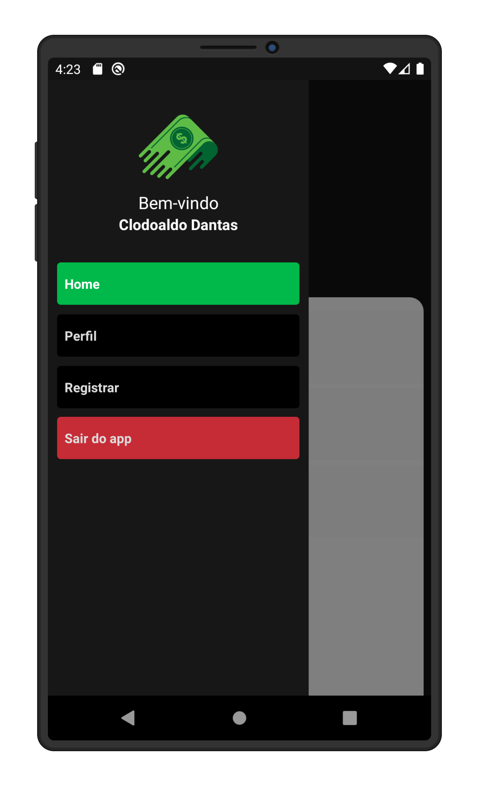

## :money_with_wings: Finanças





## :fire: Instalação

```bash
npx react-native run-android # android
npx react-native run-ios # ios
```

> Esse repositório é um projeto do curso de React Native do 📹 [Sujeito Programador](https://sujeitoprogramador.com/fabricadeaplicativos/)
